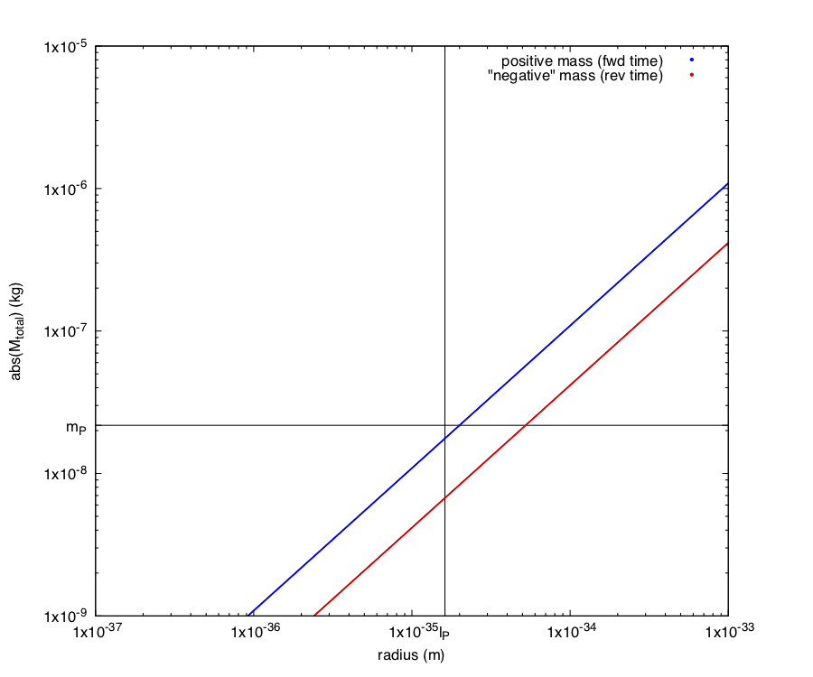
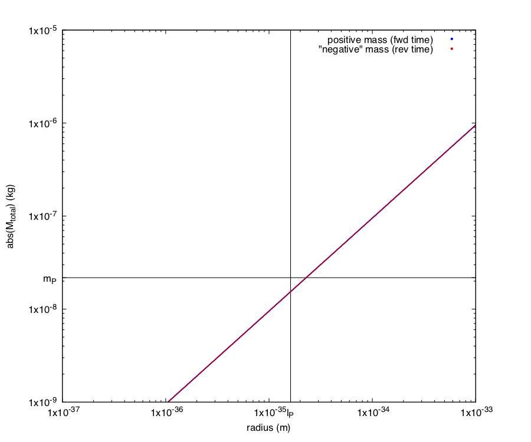
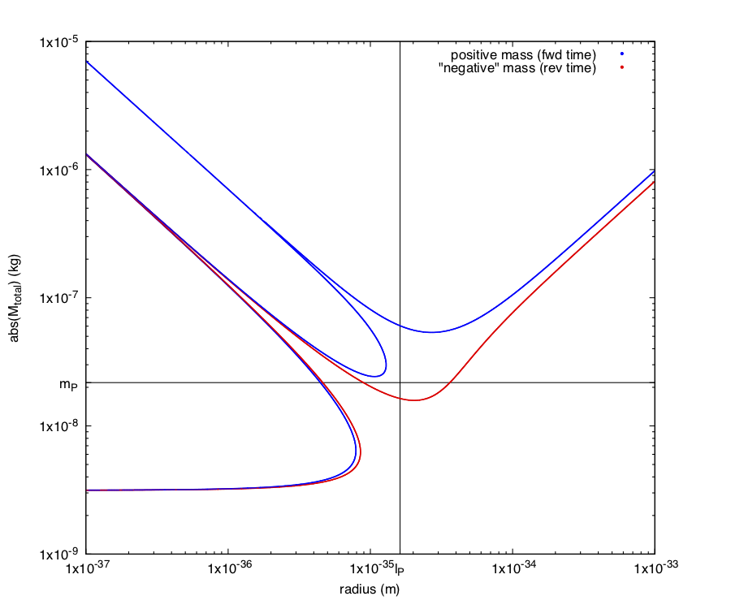
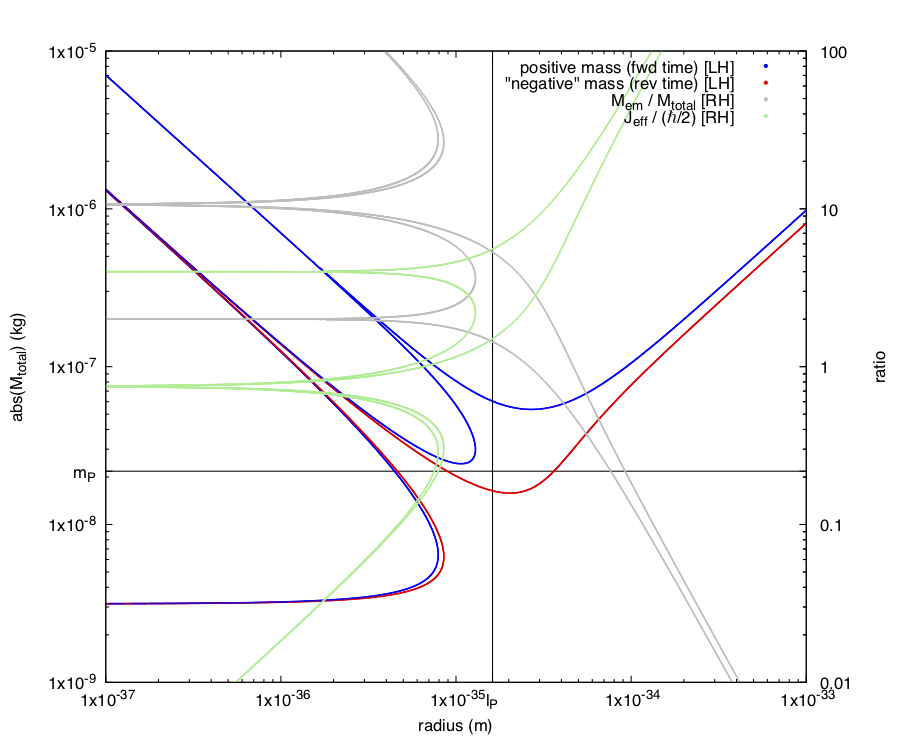

# knsolver
knsolver is a tool for exploring the [Kerr-Newman](https://en.wikipedia.org/wiki/Kerr%E2%80%93Newman_metric) (KN) metric near Planck scale

It runs in the [Julia Language](https://julialang.org/) interpreter and renders plots with [gnuplot](http://www.gnuplot.info/)

## Usage
- Edit knsolver.jl to set/change configuration parameters
- Start Julia interpreter
- Change to working directory

  `julia> cd("~/knsolver/src")`
- Load knsolver

  `julia> include("knsolver.jl")`
- run

  `julia> main()`

- knsolver will output a CSV file 'tmp.csv' and attempt to run gnuplot to generate 'tmp.pdf'. On Mac OSX it will also attempt to load 'tmp.pdf' in the Preview app. You can edit this behavior in knsolver.jl to suit your workflow.
- If you want to make parameter changes, edit knsolver.jl again, and repeat the include and main() steps.

## Background
The inspiration for this tool was to explore *neutral metric* solutions to General Relativity (where dτ^2 / dt^2 = 1, i.e. *no* time dialation), but it can be used to plot solutions to any target time ratio, including zero. That non-trivial, finite, real, neutral metric solutions exist may be surprising even to physicists, who are used to focusing on effects occuring near the zero metric. Indeed, in the trivial case with M ≠ 0, Q = 0, J = 0, and zero test particle velocity there are no finite r solutions for dτ^2 / dt^2 = 1. However, if M and any one of Q, J, or test particle velocity is non-zero, one or more solutions of finite radius exist.

## Negative Mass?
General relativity is time-symmetric. The KN metric for example is specified in terms of time squared, so that *identical* foward time and reverse time solutions exist for any given set of parameters. It is *not* however symmetric in +/- Mass. This due to having mass terms (r_s and a) that contain M that are not quadratic. If we disregard negative mass (energy) as being unphysical we are still left with positive mass operating in reverse time, which behaves *exactly* like negative mass (both gravitational and inertial) would in forward time. By combining these two features (symmetric time behavior and asymmetric mass behavior) we can accept negative values for M, understanding that it just represents positive mass operating in reverse time.

One interesting consequence is that while some solutions to the neutral metric give negative values for r (which we also consider unphysical), inverting the sign of M also inverts the sign of r, turning a negative radius into a positive radius.

## This may lead to an understanding of how Standard Model (SM) particles gain mass

(or the value of the Higgs field couplings in physicist speak)

As can be shown by knsolver plots, very nonlinear and interesting things happen right around Planck scale. If a pair of positive (foward time) and "negative" (reverse time) Planck scale masses were able to coexist in a stable resonance (with some near-field gravitational "partitioning" and resonance perhaps enforced by time neutrality) and the positive mass was slightly larger than the negative mass, there would be a tiny residual positive mass in the far field. Some version of this model might explain the [Hierarchy problem](https://en.wikipedia.org/wiki/Hierarchy_problem), (why SM particle masses are so tiny compared to the Planck mass).

### What about antiparticles?
There is nothing in this model that requires antiparticles to have negative mass, or to propogate in negative time. In fact antiparticles are known to propogate in forward time, and are known to have positive mass. The preference for forward time in macroscopic (>> Planck scale) behavior could be an intrinsic result of the non-linear solutions and resonances regardless of the chosen parameters.

## Electromagnetic self-energy and "effective" angular momentum ratios
When Q ≠ 0, care must be taken to observe the electromagnetic self-energy mass equivalent to total mass ratio as M_em / M_total > 1 would be considered 'extremal' and is likely invalid.

Likewise when J ≠ 0, the ratio of effective angular momentum J_eff (calculated from the derived mass, radius, and velocity factors for each plot point) vs ℏ/2 should be considered. Note: J_eff can and will differ from the 'J' angular momentum input parameter (Kerr-Newman variable).

Knsolver will always output this ratio to the tmp.csv but display on plots is optional. By default knsolver.jl uses 'plotkn-noratios.cfg'. You can edit that file to use 'plotkn.cfg' instead and it will draw EM self energy and angular momentum ratios with the RH axis.

## Superluminal velocities
Superluminal velocities are not required but are accepted by knsolver. This can occur on any one of the test particle velocity dimensions, or by the combination of the three. Surprisingly, these are well behaved.

It is assumed that any superluminal behavior would be limited to internal movement of tiny subcomponents of SM particles (let's call them "tachyons") operating near Planck scale and that the group velocity of SM particles would be limited to c as observed macroscopically. It also may not be appropriate to think of these values as "velocities" in the smooth integrated manner we are familiar with. Any movement near Planck scale is likely to be very "jumpy" in quantum gravity and it may be more appropriate to think of them as timing parameters than as traditional velocities. Perhaps tachyons move at exactly c in each degree of freedom a particular resononance mode supports (a simple "movement principle").

Also, when modeling rest mass in it's inertial frame group velocity would be zero. It is assumed that tachyon momenta would be distributed uniformally in n-spheres and oscillate radially, rotate (in the case of a 1-sphere), or both resulting in no macroscopic movement.

## Warning!
The author is *not* a professional physicist. It's possible and even likely that I have made some major blunder(s) here. Be sure to run any results by a real physicist before publishing or using them for anything important. **Knsolver intentionally allows inputs and outputs that might not be physical** so that users can explore the full literal mathematical effects of the Kerr-Newman metric with minimal guardrails.

## Sample Plots
-----
Neutral metric with electric charge, angular momentum, radial and equitorial test particle velocity

Parameters:
- dτ^2 / dt^2 = 1
- Q^2 = (2qP)^2
- J = ℏ/2
- θ = π/2
- dr^2 / c^2dt^2 = 1
- dθ^2 / c^2dt^2 = 0
- dφ^2 / c^2dt^2 = 1

-----
Same as above but with no electric charge. The two blue lines converge close enough that knsolver cannot detect either on the left side of the plot with the default settings. Increasing the inner loop M_increment and r_increment settings in knsolver.jl will improve this at the expense of run time.

Parameters:
- dτ^2 / dt^2 = 1
- Q^2 = 0
- J = ℏ/2
- θ = π/2
- dr^2 / c^2dt^2 = 1
- dθ^2 / c^2dt^2 = 0
- dφ^2 / c^2dt^2 = 1

-----
Neutral metric with radial test particle velocity, but no electric charge or angular momentum

Parameters:
- dτ^2 / dt^2 = 1
- Q^2 = 0
- J = 0
- θ = π/2
- dr^2 / c^2dt^2 = 1
- dθ^2 / c^2dt^2 = 0
- dφ^2 / c^2dt^2 = 0

-----
Same as above but also with equitorial velocity. In this very interesting result the red line *exactly* covers a second blue line. With dispersion in r associated with the uncertainty principle, you would get a tiny positive net mass!

Parameters:
- dτ^2 / dt^2 = 1
- Q^2 = 0
- J = 0
- θ = π/2
- dr^2 / c^2dt^2 = 1
- dθ^2 / c^2dt^2 = 0
- dφ^2 / c^2dt^2 = 1

-----
Zero metric, minimal "Schwarzschild" solution with no charge, angular momentum or test particle velocity. Unsurprisingly, this is just a plot of r_s vs M

Parameters:
- dτ^2 / dt^2 = 0
- Q^2 = 0
- J = 0
- θ = π/2
- dr^2 / c^2dt^2 = 0
- dθ^2 / c^2dt^2 = 0
- dφ^2 / c^2dt^2 = 0

-----
Neutral metric with charge, angular momentum, radial and "equitorial" test particle velocity and non-equitorial theta = 60 degrees. This is a maximal complexity solution. If expressed as a polynomial in r it would have 10 roots, as a polynomial in M it would have 9 roots!

Parameters:
- dτ^2 / dt^2 = 1
- Q^2 = (2qp)^2
- J = ℏ/2
- θ = π/3
- dr^2 / c^2dt^2 = 1
- dθ^2 / c^2dt^2 = 0
- dφ^2 / c^2dt^2 = 1

-----
Same as above but with electromagnetic self-energy and angular momentum ratios on RH axis. You can select ratio display by editing knsolver.jl to use 'plotkn.cfg' instead of 'plotkn-noratios.cfg'.

Parameters:
- dτ^2 / dt^2 = 1
- Q^2 = (2qp)^2
- J = ℏ/2
- θ = π/3
- dr^2 / c^2dt^2 = 1
- dθ^2 / c^2dt^2 = 0
- dφ^2 / c^2dt^2 = 1

-----
